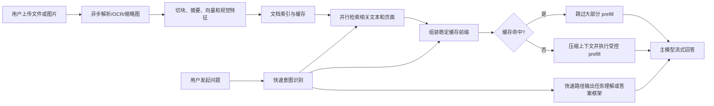
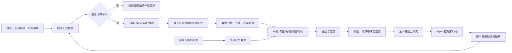
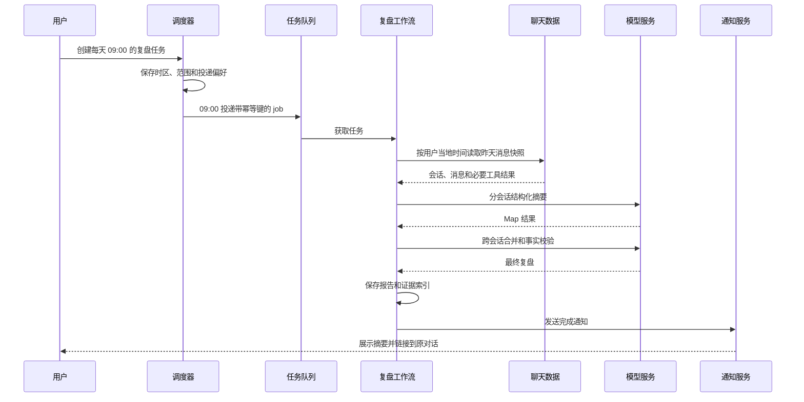
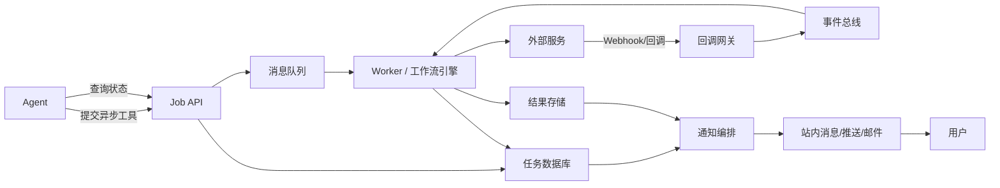

# 1. 大模型面对第一轮长窗口或多模态输入时，first token 会显著变慢。有什么快速、低成本、用户体验也不差的方案？如何从 5～10 秒稳定压缩到 2 秒？

第一轮长窗口或多模态请求的 first token 慢，本质上通常不是“生成速度慢”，而是第一枚输出 token 之前需要完成太多工作：

- 文件上传、图片下载、鉴权和跨地域网络传输；
- 文本解析、OCR、图片缩放、多模态编码；
- 请求排队；
- 对整个长上下文执行 prefill；
- 生成第一枚 token。

因此，单纯开启流式输出只能让“第一枚 token 之后”看起来更快，无法解决 first token 本身的问题。要把 5～10 秒稳定压缩到约 2 秒，核心思路是：**把重计算移出首轮关键路径、减少真正进入模型的上下文、尽可能复用缓存，并为冷启动设计可接受的降级体验。**

需要先明确一个工程事实：如果每次都把几十万 token、几十页 PDF 或大量原始图片完整、无缓存地送入大模型，那么在低成本条件下无法稳定保证 2 秒。要达到 2 秒，必须改变输入和执行链路，而不是只调整一个模型参数。

## 方案一：上传即预处理，不要等用户提问后才处理

文件或图片一上传，就立即启动异步预处理：

1. 计算文件哈希，判断是否已经处理过；
2. 提取 PDF 文本、标题、目录、页码和表格；
3. 对扫描页执行 OCR；
4. 对图片生成缩略图、低分辨率版本和视觉特征；
5. 按章节和语义切块，生成关键词、摘要和向量；
6. 将解析结果写入文档索引和对象存储；
7. 将文档摘要、结构和高频片段预热到缓存。

用户真正发出问题时，只需要发送：

- 当前问题；
- 文档的短摘要和目录；
- 检索出的少量相关片段；
- 必要的原始页面或图片区域。

这样可以将原本位于请求关键路径中的 OCR、文档解析和全量多模态编码提前完成。

对于图片，可以先用低细节模式或低分辨率缩略图完成意图判断；只有问题确实涉及细节、图表数值或局部文字时，才二次加载高分辨率图片或指定区域。对于 PDF，不应默认把每一页都作为图片交给多模态模型，而应优先使用已提取的文本，只在图表、排版或扫描内容无法通过文本回答时加载相关页面。

## 方案二：用“滚动摘要 + 检索”替代“每轮重放全部历史”

长会话不应在每轮都发送完整聊天记录。推荐将上下文分为四层：

1. **固定前缀**：系统提示词、稳定的工具定义、安全规则；
2. **短期工作记忆**：最近若干轮原始对话、当前任务状态和未完成工具调用；
3. **滚动摘要**：更早对话的结构化压缩结果；
4. **长期记忆和知识检索**：根据当前问题召回的用户事实、历史事件和文档片段。

一个实用的首轮上下文可以是：

```text
系统提示词
+ 稳定工具定义
+ 用户长期偏好摘要
+ 当前文档摘要
+ 检索 Top-K 片段
+ 最近 4～8 轮对话
+ 当前问题
```

而不是：

```text
系统提示词
+ 所有工具定义
+ 所有历史聊天
+ 整个 PDF
+ 所有图片
+ 当前问题
```

检索时不要只使用向量相似度，应该组合：

- 关键词检索；
- 向量检索；
- 时间新鲜度；
- 用户或项目范围；
- 文档页码和章节；
- 重要性分数；
- 必要时的轻量重排。

对于同一份长文档的首次问答，可以先发送目录、摘要和少量候选片段，让模型判断是否需要读取更多页面。这样形成“粗读—定位—精读”的两阶段流程，通常比一次性塞入全文更快、更便宜，也更不容易被无关内容干扰。

## 方案三：把提示词组织成可缓存的稳定前缀

主流模型服务的上下文缓存通常依赖相同前缀。因此提示词顺序应尽量保持稳定：

```text
稳定工具定义
→ 稳定系统提示词
→ 稳定用户/项目记忆
→ 稳定文档内容或文档摘要
→ 动态检索结果
→ 最近对话
→ 当前问题
```

需要避免以下行为：

- 每轮改变工具顺序；
- 在系统提示词开头插入时间戳、随机 ID；
- 每轮改写稳定规则；
- 把动态数据放在固定前缀前面；
- 无必要地增删图片；
- 将大量不断变化的工具结果放在缓存前缀中。

如果服务商提供显式 prompt caching，应在稳定前缀末尾设置缓存断点；如果使用自部署模型，则可启用 KV prefix cache。对于同一文档的连续问答、固定 Agent 工具集和固定系统提示词，缓存命中是降低 TTFT 最有效的手段之一。

但要注意：缓存只能优化重复前缀。真正的“第一次、从未见过的超长输入”仍然需要 prefill，因此第一次必须依靠预处理、压缩和分层读取。

## 方案四：设计“快速路径 + 深度路径”

为了兼顾答案质量和用户体验，可以采用双路径：

### 快速路径

在 0.5～1.5 秒内完成：

- 意图识别；
- 安全判断；
- 是否需要查文档、看图片或调用工具；
- 生成一条有信息量的开场输出；
- 给出初步结论或回答结构。

快速路径可以使用：

- 小型快速模型；
- 低 reasoning effort；
- 已缓存的主模型；
- 规则化模板与检索结果组合。

### 深度路径

并行执行：

- 高精度重排；
- 加载高分辨率图片；
- 读取更多文档页；
- 调用复杂工具；
- 使用更强模型完成推理。

快速路径输出不能只是“正在思考”，否则只是掩盖延迟。更好的第一段是：

```text
这个问题主要涉及文档中的性能瓶颈和缓存策略。我先给结论：优先减少首次 prefill，而不是只优化生成速度。下面按输入、缓存和推理服务三层说明。
```

如果快速模型和深度模型可能产生矛盾，可以让快速路径只输出稳定的任务理解、答案框架和高置信度事实，不提前输出容易被后续推翻的精确结论。

如果业务要求“第一枚 token 必须来自最终主模型”，则应放弃双模型开场，改用缓存、缩短上下文、关闭不必要的深度推理并优化服务排队。

## 方案五：优化模型服务的 prefill 和排队

如果是自部署模型，还应优化推理服务：

- 将 prefill 和 decode 分离，分别扩缩容；
- 为长上下文请求设置独立队列，避免阻塞普通请求；
- 启用 chunked prefill；
- 启用 prefix/KV cache；
- 缓存多模态编码结果；
- 对同一图片或文档使用内容哈希复用编码；
- 使用连续批处理，但为交互请求保留低排队延迟通道；
- 对超长输入设置 token 预算和检索上限；
- 使用量化或更小的路由模型处理首轮判断；
- 提前建立 SSE、WebSocket 或 HTTP/2 连接；
- 将网关、模型和数据存储部署在相近地域；
- 避免函数实例冷启动。

prefill 和 decode 的资源特征不同。长上下文请求通常更偏计算密集，decode 更偏显存带宽和持续生成。将两者拆分后，可以独立增加 prefill 资源，不必为了降低 TTFT 同比例扩容全部 decode 资源。

## 推荐的 2 秒时延预算

在缓存命中、文件已预处理的前提下，可以按以下预算设计：

| 环节 | 目标耗时 |
|---|---:|
| 网关、鉴权、连接 | 50～150 ms |
| 意图识别与上下文组装 | 100～250 ms |
| 检索与轻量重排 | 100～300 ms |
| 模型排队 | 100～300 ms |
| 缓存命中后的 prefill | 300～700 ms |
| 第一枚 token 解码与传输 | 50～150 ms |
| 合计 | 700～1850 ms |

实际 SLA 应分别定义：

- `TTFV`：用户看到第一条有效反馈的时间；
- `TTFT`：模型第一枚有效 token 的时间；
- `Time to Useful Answer`：出现第一个可用结论的时间；
- P50、P95、P99；
- 缓存命中和缓存未命中的指标。

冷缓存、首次上传、超长原始多模态输入不应与普通请求使用同一个 2 秒 SLA。比较合理的策略是：

- 热路径：P95 TTFT 不超过 2 秒；
- 冷路径：300 ms 内显示真实处理进度，随后流式返回；
- 超长任务：自动转为异步处理，完成后通知。



综合来看，最具性价比的组合是：

1. 上传时预处理；
2. 滚动摘要与 Top-K 检索；
3. 固定前缀缓存；
4. 图片低细节优先、按需升级；
5. 快速路径和深度路径并行；
6. 长请求独立排队；
7. 以 P95 而不是单次最好成绩验收。

---

# 2. 你理解的 Agent memory 经典框架是什么？它的发展趋势是什么，最头部的玩家在怎么做？

Agent memory 不是简单保存聊天记录，也不是在提示词中塞入更多历史。一个完整的 Agent memory 系统，应当解决五个问题：

1. 什么值得记住；
2. 以什么结构保存；
3. 什么时候读取；
4. 新旧记忆冲突时如何更新；
5. 什么时候遗忘、删除或禁止使用。

## 经典分层

我理解的经典框架可以分为短期记忆、长期记忆和外部知识三部分。

### 1. 短期记忆或工作记忆

短期记忆服务于当前任务，通常包括：

- 最近若干轮消息；
- 当前计划；
- 已完成和未完成步骤；
- 工具调用及结果；
- 临时变量；
- 当前文档和页面；
- Agent 的 checkpoint。

它的特点是强时序、强任务相关、生命周期较短。实现上通常使用会话状态、消息日志、Redis、数据库 checkpoint 或工作流状态机。

### 2. 长期语义记忆

语义记忆保存相对稳定的事实，例如：

- 用户偏好；
- 用户明确提供的个人信息；
- 项目技术栈；
- 业务规则；
- 某个实体之间的关系；
- 已确认的长期约束。

它不应只是原始聊天片段，而应是带有主体、内容、置信度、来源和有效时间的结构化事实。

### 3. 长期情景记忆

情景记忆保存发生过的事件和结果，例如：

- 用户上次尝试了什么；
- 某次部署为什么失败；
- Agent 采用了什么方案；
- 用户对结果给出了什么反馈；
- 某个工具调用的环境、过程和结果。

情景记忆适合回答“以前发生过什么”和“上次是怎么解决的”。

### 4. 程序性记忆

程序性记忆保存“如何做事”，例如：

- 常用工作流；
- 项目编码规范；
- 处理某类故障的步骤；
- 用户偏好的交付格式；
- 成功或失败案例中总结出的操作策略；
- Agent 可复用的 skill、规则和提示词。

程序性记忆往往表现为 Agent 规则、技能文件、工作流模板、few-shot 示例或可执行策略。

### 5. 外部知识

企业文档、产品手册、代码库和网页属于外部知识，而不是严格意义上的用户记忆。它们可以和 memory 共用检索基础设施，但必须在权限、生命周期和更新机制上分开：

- memory 回答“这个用户、这个 Agent 或这个任务以前发生过什么”；
- knowledge 回答“外部世界或组织知识是什么”。

## 经典的写入—管理—读取闭环



## 推荐的数据模型

每条长期记忆至少应包含：

```text
memory_id
user_id / actor_id / project_id
memory_type
content
structured_fields
source_message_ids
created_at
valid_from
valid_to
confidence
importance
last_accessed_at
access_count
status
supersedes_memory_id
visibility_scope
retention_policy
```

其中最重要的是：

- **来源**：记忆必须能追溯到原始消息或事件；
- **有效时间**：用户偏好和项目状态可能变化；
- **冲突链**：不要简单覆盖旧记忆，应记录新记忆取代了什么；
- **作用域**：区分用户级、项目级、Agent 级和组织级；
- **置信度**：模型推断不能与用户明确陈述等价；
- **可删除性**：用户应能查看、修改和删除长期记忆。

## 写入策略

不能每轮都把所有内容写成长期记忆，否则会产生记忆污染和无限增长。可以使用以下判断：

- 用户是否明确要求记住；
- 信息是否会跨会话复用；
- 是否是稳定偏好或长期约束；
- 是否影响未来决策；
- 是否是一次有代表性的成功或失败经验；
- 是否包含敏感信息；
- 是否与已有记忆重复或冲突。

推荐采用两级写入：

1. **同步轻写入**：保存原始事件、明确记忆指令和高置信度事实；
2. **异步深加工**：批量提取事实、生成情景摘要、做去重和冲突合并。

这样可以避免记忆提取模型增加每轮对话延迟。

## 读取策略

长期记忆读取不应只执行一次向量 Top-K。推荐使用：

- 当前问题生成多个检索查询；
- 关键词、向量、时间和实体联合召回；
- 按用户、项目和权限过滤；
- 考虑新鲜度、重要性和置信度；
- 对冲突记忆进行时间判断；
- 对结果做去重和压缩；
- 只向模型注入完成任务所需的最少记忆。

典型评分可以表示为：

```text
score =
语义相关度
+ 关键词匹配
+ 时间新鲜度
+ 重要性
+ 任务作用域匹配
+ 历史使用效果
- 冲突风险
- 隐私风险
```

## 发展趋势

### 1. 从“完整历史”转向“选择性上下文”

更长的上下文窗口不会消灭 memory。完整历史成本高、TTFT 慢，而且容易被无关内容干扰。趋势是保存完整事件，但只召回少量高价值上下文。

### 2. 从被动 RAG 转向 Agent 主动管理记忆

早期系统通常在每轮固定检索一次。现在越来越多系统把记忆做成工具，让 Agent 自己决定何时：

- 搜索；
- 写入；
- 更新；
- 合并；
- 删除；
- 总结；
- 建立新索引。

### 3. 从扁平向量库转向类型化、分层和时间化

只存文本块和 embedding 很难处理：

- 事实更新；
- 时间变化；
- 实体关系；
- 多步事件；
- 冲突；
- 来源追踪。

因此系统正在引入结构化事实、事件流、知识图谱、双时间模型、命名空间和版本链。

### 4. 从同步写入转向异步 consolidation

记忆写入会越来越像数据库的日志和物化视图：

- 前台快速追加原始事件；
- 后台异步提取事实；
- 定期合并重复记忆；
- 根据反馈调整重要性；
- 对过期内容执行遗忘；
- 必要时重建索引。

### 5. 从单 Agent 记忆转向跨 Agent 共享

企业场景需要多个 Agent 在受控范围内共享：

- 用户偏好；
- 项目状态；
- 工具经验；
- 业务实体；
- 组织知识。

因此 memory 会出现用户、会话、项目、团队、组织等多级 namespace，并配套访问控制。

### 6. 从“能记住”转向“可治理”

头部平台越来越重视：

- TTL；
- 编辑和删除；
- 加密；
- 用户隔离；
- 来源追踪；
- 审计；
- 敏感信息过滤；
- 跨地域和数据驻留；
- 防止工具输出中的提示注入进入长期记忆。

### 7. 从召回准确率转向任务效果评测

未来不仅评估“是否找到了某条历史”，还要评估：

- 记忆是否在正确时机被调用；
- 是否改善任务成功率；
- 是否错误影响了决策；
- 是否能正确处理更新和矛盾；
- 是否减少 token、延迟和成本；
- 是否能从失败经验中改进工具使用。

## 代表性玩家的做法

### Anthropic

Anthropic 将 memory 设计为 Agent 可调用的工具，底层可以由文件、数据库、云存储或加密存储实现。核心思想是：不要把所有信息预先塞进上下文，而是让 Agent 按需读写。Claude Code 则使用项目规则文件、自动记忆和分层文件来保存项目约定、环境信息和长期经验。

优点是透明、可编辑、适合编码 Agent；不足是记忆质量很依赖 Agent 自己的写入纪律和文件组织。

### OpenAI

OpenAI 更偏向提供状态和检索基础设施，包括 Conversation 状态、Responses API、Vector Store 和 File Search。它没有强制一种统一的“类人记忆模型”，而是让开发者在会话状态、外部存储和检索之间自行组合。

优点是平台原语完整、容易与 Agent 工具链结合；不足是长期记忆的抽取、冲突处理和遗忘策略仍需要应用层设计。

### Google

Google Vertex AI Agent Engine Memory Bank 将会话事件生成长期记忆，并通过 ADK 的 memory service 读写。它强调托管式记忆生成、检索、TTL 和 Agent Engine 集成，适合 Google Cloud 上的生产 Agent。

### AWS

Amazon Bedrock AgentCore Memory 明确区分：

- 短期原始事件；
- 长期语义记忆；
- 用户偏好；
- 摘要；
- 情景记忆；
- 自定义策略。

同时提供 actor、session、namespace、保留期限和 KMS 加密，企业治理能力较完整。

### LangGraph

LangGraph 将短期记忆放在 graph state 和 checkpoint 中，将长期记忆放在 store 中，并明确区分 semantic、episodic 和 procedural memory。它的优势是工作流状态、恢复和 memory 可以统一在图执行模型中。

### Letta

Letta 延续 MemGPT 思路，将有限上下文视为“工作内存”，将 memory blocks 作为始终可见或可编辑的核心记忆，将大规模内容放入 archival memory。Agent 可以主动修改自己的核心记忆，适合长时间运行的有状态 Agent。

### 国内代表性平台

火山引擎的数据智能体将长期记忆拆为事件记忆和画像记忆，支持全局或领域策略、有效期以及跨 Agent 共享。阿里云百炼提供长期记忆体、记忆片段和记忆变量，并在后续会话中自动召回。国内平台的共同趋势是把 memory 从框架组件变成可配置的企业产品能力，强调用户画像、业务领域、权限和生命周期。

## 我的推荐架构

生产环境中，我不会选择“只用向量数据库”或“只用长上下文”，而会使用：

```text
不可变事件日志
+ 当前会话 checkpoint
+ 结构化语义事实
+ 情景摘要
+ 程序性技能
+ 向量、关键词、时间和图混合检索
+ 异步 consolidation
+ 版本、TTL、权限和删除机制
```

Memory 的目标不是记得越多越好，而是：**在正确时间，以可验证、可撤销、低成本的方式，提供足够但不过量的历史。**

---

# 3. 用户给 Agent 下达任务：每天早上 9 点根据昨天聊天情况做复盘总结。你会怎么设计？

这个需求不是简单的 cron 加一次大模型调用，而是一个包含时间边界、数据权限、幂等、总结质量、失败重试和通知的定时 Agent 工作流。

## 1. 创建任务时保存完整配置

用户创建任务时，需要保存：

```text
task_id
user_id
timezone
schedule
enabled
conversation_scope
summary_template
delivery_channel
language
include_action_items
memory_write_policy
created_at
updated_at
```

其中必须明确：

- 使用用户时区，而不是服务器时区；
- “昨天”定义为用户当地时间前一天的 `[00:00, 24:00)`；
- 汇总哪些聊天：全部聊天、指定 Agent、指定项目或指定会话；
- 是否包含工具调用结果和附件内容；
- 是否允许把总结中的信息写入长期记忆；
- 通过站内消息、推送、邮件还是其他渠道发送。

若用户跨时区旅行，可以选择：

- 始终使用创建任务时的固定时区；
- 跟随用户当前时区；
- 每次变更时提示用户确认。

生产系统中更推荐固定时区，避免同一天重复或遗漏执行。

## 2. 调度层只负责触发，不直接做总结

每天 9 点，调度器产生一条任务消息：

```text
job_id
task_id
user_id
target_date
window_start
window_end
idempotency_key
attempt
```

幂等键可以是：

```text
daily-review:{task_id}:{target_date}:v1
```

即使调度器重复触发、消息队列重复投递，也只能生成一份正式日报。

## 3. 按事件时间读取昨天的聊天快照

数据读取必须使用消息实际发生时间，而不是数据库写入时间。流程如下：

1. 获取昨天时间窗口内的用户和 Agent 消息；
2. 排除用户已删除、撤回或明确不允许总结的内容；
3. 按会话和主题分组；
4. 去除重复消息、系统噪声和无意义心跳；
5. 读取必要的工具结果，但不把密钥、内部日志和超长原始输出直接交给模型；
6. 为这次总结创建不可变输入快照。

为了处理延迟写入，可以在 9 点读取时设置少量 watermark；如果 9 点后才到达一条属于昨天的消息，可在后台生成修订版，但不应反复通知用户，除非变化重要。

## 4. 使用 Map-Reduce 总结，而不是一次塞入全部聊天

如果昨天聊天很多，推荐两阶段总结。

### Map 阶段：逐会话生成结构化摘要

每个会话输出统一 JSON：

```json
{
  "topics": [],
  "decisions": [],
  "completed": [],
  "problems": [],
  "open_questions": [],
  "next_actions": [],
  "important_facts": [],
  "evidence_message_ids": []
}
```

短会话可以使用小模型，复杂会话再使用强模型。

### Reduce 阶段：跨会话合并

合并时需要：

- 去重；
- 识别同一事项的多次讨论；
- 区分“讨论过”和“已经决定”；
- 区分“Agent 建议”和“用户承诺”；
- 识别仍未解决的问题；
- 根据用户习惯生成简洁或详细版本；
- 保留每个结论对应的消息 ID，便于用户点回原对话。

最终可以采用以下结构：

```text
昨日概览
完成事项
重要决定
遇到的问题
尚未解决
今天建议优先处理
值得长期记住的信息
```

“今天建议优先处理”应基于聊天中真实存在的未完成事项，不能凭空生成待办。

## 5. 对总结做事实校验

在发送前增加一层校验：

- 每个关键结论是否能找到消息证据；
- 是否把 Agent 的猜测误写成用户事实；
- 是否把计划误写成已完成；
- 是否遗漏明确的决定；
- 是否包含敏感信息；
- 是否错误混入其他用户或其他项目的数据；
- 是否出现日期错位。

对低置信度内容可以使用措辞：

```text
可能需要继续确认：
- 昨天讨论了数据库迁移时间，但没有看到最终确认。
```

而不是：

```text
你已经决定今天迁移数据库。
```

## 6. 生成报告、投递和记忆写入应分开

总结完成后：

1. 保存报告正文和结构化结果；
2. 将状态设置为 `SUCCEEDED`；
3. 发送站内通知或用户指定渠道；
4. 用户打开后可以跳转到原始会话；
5. 只有符合策略的信息才进入长期记忆。

不应默认把整份日报写入长期记忆。更合理的是只提取：

- 明确且稳定的用户偏好；
- 已确认的长期项目事实；
- 重要决定；
- 可复用的成功或失败经验。

对于“用户今天心情不好”之类短期或敏感推断，不应自动写入长期记忆。

## 7. 失败、重试和空数据处理

任务状态可以是：

```text
SCHEDULED
QUEUED
COLLECTING
SUMMARIZING
VALIDATING
DELIVERING
SUCCEEDED
FAILED
SKIPPED
```

失败策略：

- 临时网络或模型错误：指数退避重试；
- 某个会话摘要失败：记录失败并继续处理其他会话；
- 全部失败：进入死信队列并通知运维；
- 通知失败但报告成功：只重试通知，不重新生成总结；
- 重试时使用相同幂等键，避免生成多个版本。

如果昨天没有有效聊天，可以根据用户偏好：

- 不发送通知；
- 或发送“昨天没有需要复盘的聊天记录”。

## 8. 隐私和安全

需要提供：

- 查看任务读取范围；
- 暂停或删除任务；
- 删除历史总结；
- 关闭长期记忆写入；
- 排除指定会话；
- 导出总结；
- 对敏感会话设置“永不用于自动总结”。

工具结果和网页内容属于不可信数据，进入总结模型前应保留数据边界，不能让其中的提示文本改变总结规则。



---

# 4. Agent 工具有同步和异步两类。异步工具不能让用户一直等，但结果依然重要。你会如何设计异步工具执行和完成通知？

异步工具的关键不是“开一个后台线程”，而是建立一个可持久化、可恢复、可查询、可通知的任务协议。

## 1. Agent 调用异步工具后立即返回任务凭证

异步工具第一次返回的不是最终结果，而是：

```json
{
  "job_id": "job_123",
  "status": "QUEUED",
  "accepted_at": "2026-08-04T10:00:00+08:00",
  "result_type": "report",
  "status_url": "/jobs/job_123",
  "cancel_supported": true
}
```

Agent 应立即告诉用户：

```text
任务已经提交，你可以离开当前页面。完成后我会在这里通知你，任务编号为 job_123。
```

此时 Agent 必须结束当前等待循环，不能持续轮询并占用模型或连接。

## 2. 使用统一任务状态机

推荐状态：

```text
CREATED
QUEUED
RUNNING
WAITING_EXTERNAL
WAITING_USER
SUCCEEDED
FAILED
CANCEL_REQUESTED
CANCELLED
EXPIRED
```

状态转换必须持久化，并带有：

- 状态版本；
- 更新时间；
- 当前进度；
- 重试次数；
- 错误类型；
- 结果位置；
- 原始 Agent 任务 ID；
- 用户 ID；
- 权限范围。

如果工具需要用户补充信息，应进入 `WAITING_USER`，并发送一条可操作通知，而不是让任务静默超时。

## 3. 执行层采用队列和 durable workflow

典型架构为：



工作流必须能够在进程重启后恢复，不能只依赖内存中的 future 或线程。

## 4. 回调优先，轮询兜底

如果外部服务支持 webhook：

1. 提交任务并保存 provider_job_id；
2. 返回 job_id；
3. 外部服务完成后回调；
4. 验证签名、时间戳和重放保护；
5. 根据 provider_job_id 找到内部任务；
6. 拉取或接收最终结果；
7. 校验结果；
8. 原子更新任务状态；
9. 发布 `job.completed` 事件。

如果外部服务不支持回调：

- 使用延迟队列或定时轮询；
- 采用指数退避；
- 设置最大执行时间；
- 避免每个任务启动一个永久线程；
- 用户主动打开任务页时可以触发一次即时查询，但不能依赖用户轮询才能完成。

## 5. 保证至少一次执行下的幂等性

实际消息队列和 webhook 通常是“至少一次”，可能重复投递。因此必须设计：

- 提交幂等键；
- Worker 幂等；
- 外部调用幂等；
- 结果写入幂等；
- 通知幂等。

例如：

```text
idempotency_key =
user_id + tool_name + normalized_arguments + request_version
```

完成事件可以使用：

```text
notification_key = job_id + terminal_status + result_version
```

即使收到三次完成回调，也只发送一次正式通知。

对于不可重复的操作，例如付款、发邮件或删除数据，必须在业务数据库中使用唯一约束、事务或 outbox，而不是只依赖 Redis 锁。

## 6. 结果到达后分两层通知

### 第一层：完成通知

通知应简洁，包含：

- 任务名称；
- 成功、失败或需要输入；
- 一句话结果摘要；
- 完整结果入口；
- 必要操作；
- 是否可以重试或取消。

例如：

```text
代码仓库安全扫描已完成：发现 2 个高风险、5 个中风险问题。点击查看报告和修复建议。
```

### 第二层：Agent 续跑

如果用户需要的不只是工具原始结果，而是 Agent 基于结果继续推理，可以创建一个 continuation job，输入：

```text
原始用户目标
+ 原始 Agent 计划
+ 工具调用参数
+ 工具最终结果
+ 当前权限和安全规则
```

续跑 Agent 生成最终解释后再通知用户。

但不应无条件自动执行高风险后续操作。异步工具完成后可以自动：

- 生成报告；
- 汇总结果；
- 更新任务状态。

涉及付款、发布、删除、发送邮件、修改生产环境等行为，仍应请求用户确认。

## 7. 工具结果不要全部塞回聊天上下文

异步结果可能很大。推荐：

- 完整结果存对象存储、数据库或 artifact store；
- 聊天中只注入结构化摘要；
- 保留 artifact_id、版本和访问权限；
- Agent 需要细节时再调用读取工具；
- 对日志和网页结果进行提示注入隔离；
- 超长结果先分块、过滤和摘要。

这样既节省 token，也避免一个巨大工具结果污染后续所有对话。

## 8. 用户体验设计

前端应提供任务卡片：

```text
任务名称
当前状态
创建时间
最后更新时间
进度或阶段
取消
重试
查看结果
关闭通知
```

良好的体验包括：

- 用户关闭页面后任务继续；
- 可在任务中心找到历史任务；
- 失败原因可理解；
- 重试不会产生重复副作用；
- 完成通知可跳回原聊天；
- 同一个任务的进度更新合并显示，避免刷屏；
- 支持取消，但明确取消请求不一定能立刻停止外部服务；
- 对耗时很长的任务发送阶段性更新，而不是频繁百分比假进度。

## 9. 异常处理

需要分别处理：

- 外部服务接受任务但回调丢失；
- 回调先于数据库写入到达；
- 外部服务重复回调；
- 工具成功但结果下载失败；
- 任务成功但通知失败；
- 用户在执行中删除任务；
- 用户权限在任务期间被撤销；
- 结果产生时原始资源已经发生变化；
- Agent continuation 失败；
- 系统重启。

关键措施包括：

- 事务 outbox；
- inbox 去重；
- 指数退避；
- 死信队列；
- 定期 reconciliation；
- 状态版本号；
- 结果版本检查；
- 任务级审计日志；
- 终态任务不可被旧事件回退。

最核心的设计原则是：**异步工具的执行状态属于业务系统，而不是属于某一次模型对话。模型可以发起和解释任务，但不能成为任务可靠性的唯一载体。**

---

# 5. Claude Code 的工具输出方式和国内 GLM、豆包等 OpenAI-compatible function calling 有什么不同？他们各自这样设计的优缺点是什么？

首先需要区分两个层次：

- Claude Code 是一个完整的编码 Agent 运行时，包含权限确认、本地工具执行、上下文管理、进度展示和会话恢复；
- GLM、豆包等所谓 OpenAI-compatible function calling，主要描述模型 API 的消息协议。

因此，比较时应重点比较 Claude/Anthropic 的 tool use 内容块协议，与 OpenAI-compatible 的 `tool_calls + role=tool` 协议。Claude Code 在此基础上又增加了一层 Agent harness。

## 1. Anthropic/Claude 的工具协议

定义工具时使用：

```json
{
  "name": "read_file",
  "description": "读取指定文件",
  "input_schema": {
    "type": "object",
    "properties": {
      "path": {"type": "string"}
    },
    "required": ["path"]
  }
}
```

模型调用工具时，assistant 的 `content` 数组中出现 `tool_use` 内容块：

```json
{
  "role": "assistant",
  "content": [
    {
      "type": "text",
      "text": "我先读取配置文件。"
    },
    {
      "type": "tool_use",
      "id": "toolu_123",
      "name": "read_file",
      "input": {
        "path": "config.yaml"
      }
    }
  ],
  "stop_reason": "tool_use"
}
```

工具执行后，调用方使用一条 `role=user` 消息返回 `tool_result`：

```json
{
  "role": "user",
  "content": [
    {
      "type": "tool_result",
      "tool_use_id": "toolu_123",
      "content": "server:\n  port: 8080",
      "is_error": false
    }
  ]
}
```

`tool_result.content` 不仅可以是字符串，还可以是文本块、图片、文档或搜索结果等富内容。工具错误通过 `is_error` 表达。

Claude 还区分：

- 客户端执行工具；
- Anthropic 服务器执行工具；
- 暂停后继续的 server-side agent loop；
- 同一轮中的多个并行工具调用。

Claude Code 的 Read、Edit、Bash 等工具通常由本地 Claude Code 运行时执行。Claude Code 负责权限询问、执行、结果裁剪、展示和重新注入模型。

## 2. OpenAI-compatible function calling

GLM、豆包以及大量国内模型服务通常兼容 Chat Completions 风格。

定义工具：

```json
{
  "type": "function",
  "function": {
    "name": "read_file",
    "description": "读取指定文件",
    "parameters": {
      "type": "object",
      "properties": {
        "path": {"type": "string"}
      },
      "required": ["path"]
    }
  }
}
```

模型返回：

```json
{
  "role": "assistant",
  "content": null,
  "tool_calls": [
    {
      "id": "call_123",
      "type": "function",
      "function": {
        "name": "read_file",
        "arguments": "{\"path\":\"config.yaml\"}"
      }
    }
  ]
}
```

执行后使用特殊的 `tool` 角色返回结果：

```json
{
  "role": "tool",
  "tool_call_id": "call_123",
  "content": "{\"port\":8080}"
}
```

一般通过 `finish_reason=tool_calls` 表示模型正在等待工具结果。

在流式输出中，`function.arguments` 经常被拆成多个字符串片段，客户端需要按 `index` 和 `tool_call_id` 拼接，直到形成完整 JSON。

火山方舟的新 Responses API 也提供 `function_call`、`function_call_output` 等更接近事件化的结构，但大量 OpenAI-compatible 应用仍使用 Chat Completions 风格。

## 3. 核心差异

| 维度 | Claude/Anthropic | OpenAI-compatible |
|---|---|---|
| 工具调用位置 | assistant 的 `content` 内容块 | assistant 的 `tool_calls` 字段 |
| 工具结果角色 | `role=user` 中的 `tool_result` 块 | 独立的 `role=tool` 消息 |
| 关联方式 | `tool_use_id` | `tool_call_id` |
| 参数类型 | `input` 通常直接是 JSON 对象 | `arguments` 常是 JSON 字符串 |
| 结果类型 | 支持文本、图片、文档、搜索结果等内容块 | 传统兼容协议多为字符串或 JSON 文本 |
| 错误表达 | `is_error=true` | 通常由内容或应用自定义字段表达 |
| 停止原因 | `stop_reason=tool_use` | `finish_reason=tool_calls` |
| 文本与工具混排 | 同一个 content 数组自然排序 | content 与 tool_calls 分离 |
| 消息模型 | 工具是多模态内容块的一种 | 工具是消息协议的特殊字段和角色 |
| 服务器工具 | 有明确 `server_tool_use` 和服务器循环 | 各厂商实现差异较大 |
| 流式参数 | content block 事件和 JSON input delta | `tool_calls[index].function.arguments` 字符串 delta |
| 生态兼容性 | Anthropic 原生生态 | 接近行业事实标准，适配范围更广 |

## 4. Claude/Anthropic 设计的优点

### 富内容统一

文本、图片、文档、工具调用和工具结果都属于 content block，因此一个工具可以直接返回图片、文档或搜索结果，不需要额外发明附件协议。

### 顺序和语义清晰

模型可以先输出一段解释，再调用工具，也可以在一个 assistant 回合中产生多个有顺序的内容块。对于复杂 Agent 轨迹，事件语义比较自然。

### 工具结果边界明确

工具结果保留在 `tool_result` 块内，更容易将其视为不可信外部内容，降低把网页、邮件或日志中的恶意指令当成系统指令的风险。

### 对 Agent 场景更原生

服务器工具、客户端工具、并行调用、暂停与恢复都可以放在统一内容块和停止原因中表达，适合 Claude Code 这种长时间运行的编码 Agent。

### 参数对象更容易使用

`input` 是结构化对象，应用层通常不需要先拼接和解析一段 JSON 字符串。

## 5. Claude/Anthropic 设计的缺点

### 消息顺序要求严格

`tool_result` 必须紧跟对应的 `tool_use`，并且在 user content 数组中通常需要放在普通文本之前。漏掉结果、顺序错误或混入错误消息都可能导致请求失败。

### 状态机更复杂

同时存在客户端工具、服务器工具、并行调用和暂停回合时，应用需要更精确地管理消息历史。

### 生态兼容成本较高

很多框架、网关和国产模型首先支持 OpenAI 格式。使用 Anthropic 原生协议时，经常需要单独的 adapter。

### 动态工具可能影响缓存

工具数组属于提示词前缀的一部分。频繁增删或调整工具定义可能导致缓存失效，必须配合工具搜索、延迟加载或稳定工具排序。

## 6. OpenAI-compatible 设计的优点

### 生态最大

大量 SDK、Agent 框架、API 网关、监控系统和模型服务都支持：

```text
tools
tool_calls
role=tool
tool_call_id
```

开发者只需要更换 base URL 和模型名，就能以较低成本接入 GLM、豆包、DeepSeek、Qwen 等服务。

### 消息角色直观

工具结果使用独立 `tool` 角色，与普通 user 消息分开，传统聊天系统容易理解和存储。

### 适合普通函数调用

对于“输入 JSON、执行函数、返回 JSON”的业务 API，协议简单、成熟、容易调试。

### 便于多供应商抽象

如果应用只使用最小公共能力，OpenAI-compatible 可以降低供应商切换成本。

## 7. OpenAI-compatible 设计的缺点

### “兼容”不等于行为一致

不同厂商可能在以下方面存在差异：

- 是否支持并行工具调用；
- 是否支持 strict JSON Schema；
- 参数是否一定是合法 JSON；
- 流式 tool call 如何分片；
- 是否允许同时输出文本和工具调用；
- reasoning 内容如何返回；
- tool choice 的支持程度；
- 错误字段；
- 多模态工具结果；
- 最大工具数量和 schema 长度；
- 是否支持服务器托管工具。

因此，不能因为 API 字段相同就认为模型行为完全可替换。

### 参数是字符串，流式拼接较麻烦

`arguments` 经常是逐段输出的 JSON 字符串，客户端必须：

- 按 tool call 索引聚合；
- 处理半个 UTF-8 字符或半个 JSON 字段；
- 等流结束后再校验；
- 在解析失败时进行修复或重试。

### 富工具结果缺少统一标准

传统 `role=tool` 的 content 多数是文本，图片、文件、引用和结构化 artifact 的表达方式取决于厂商或应用自定义。

### 最小公共协议会限制原生能力

为了同时兼容多家模型，框架往往只使用最弱的共同能力，从而无法充分利用某家模型的服务器工具、丰富内容块、暂停恢复或严格结构化输出。

### 协议转换可能影响模型效果

一些模型在训练时使用自己的原生工具标记，服务端再转换为 OpenAI 格式。多轮历史、并行工具和流式参数在转换过程中可能出现细微差异，导致工具选择和参数质量下降。

## 8. Claude Code 额外提供了什么

Claude Code 的优势不只来自 Anthropic 消息格式，还来自其运行时：

- 内置文件、搜索、Shell 和编辑工具；
- 执行前权限确认；
- 对高风险命令的限制；
- 本地项目上下文；
- 工具输出裁剪；
- 大结果存文件并按需读取；
- 子 Agent；
- 会话恢复；
- 项目和自动记忆；
- 对长任务的进度展示。

如果只把 GLM 或豆包的 OpenAI-compatible function calling 接到一个简单 while 循环中，并不能自动获得 Claude Code 的这些能力。要实现相近体验，还需要自己建设 Agent harness。

## 9. 工程上的推荐做法

应用内部不要直接绑定任意一种供应商消息格式，而应定义统一事件模型：

```text
ToolCallRequested
ToolCallStarted
ToolCallProgress
ToolCallSucceeded
ToolCallFailed
ToolCallCancelled
```

内部工具调用对象可以是：

```json
{
  "call_id": "internal_123",
  "tool_name": "read_file",
  "arguments": {},
  "status": "REQUESTED",
  "result_artifact_id": null,
  "error": null,
  "provider": "anthropic",
  "provider_call_id": "toolu_123"
}
```

然后实现：

- Anthropic adapter；
- OpenAI-compatible adapter；
- 各国产厂商能力差异配置；
- JSON Schema 校验；
- 参数修复和有限重试；
- 并行工具能力探测；
- 大结果 artifact 化；
- 工具结果提示注入隔离；
- 可观测性和轨迹回放。

选择协议时可以遵循：

- 构建 Claude 原生、复杂多模态或编码 Agent：优先 Anthropic 内容块协议；
- 需要快速接入多家国产模型、普通业务函数调用：优先 OpenAI-compatible；
- 生产级多模型系统：内部统一事件模型，外部使用 provider adapter，不把业务状态直接绑定在某家 API 的消息格式上。
