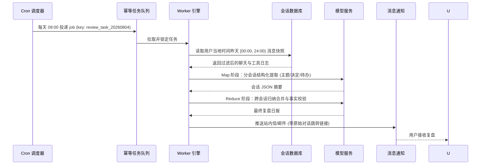
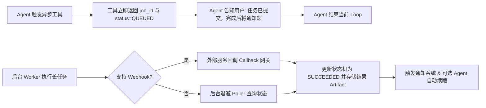

# 1. 大模型面对第一轮长窗口或多模态输入时，first token 会显著变慢。有什么快速、低成本、用户体验也不差的方案？如何从 5～10 秒稳定压缩到 2 秒？

## 核心诊断
首轮 TTFT（Time to First Token）慢的本质是 **Prefill 阶段计算量过大** + **文件/多模态预处理阻塞关键路径**。要低成本压缩到 2 秒，核心思路是：**将重计算移出主路径、滚动压缩历史、稳定前缀复用缓存、设计双路径降级体验。**

---

## 5 大核心优化方案

### 1. 上传即预处理（解耦主路径）
- **文件上传即触发异步管道**：异步完成哈希去重、PDF 文本/表格提取、扫描件 OCR、图片缩略与向量化切块。
- **按需加载多模态**：优先使用纯文本回答；仅当提问涉及图表与排版细节时，才按需加载指定页面/区域的高清图像。

### 2. 滚动摘要 + 分层检索（缩减 Context 规模）
- **上下文分层管理**：
  - `固定前缀`：系统提示词 + 稳定工具 Schema
  - `短期工作记忆`：最近 4~8 轮原始对话
  - `滚动摘要`：早期历史的结构化压缩总结
  - `知识召回`：Top-K 相关文档/记忆片段
- **两阶段读取**：采用“粗读（目录+摘要）→ 定位 → 精读（具体片段）”流程，避免一次性塞入几十万字全文。

### 3. 稳定 Prompt 前缀（最大化 Prefix/Prompt Caching）
- **固定顺序**：`稳定工具定义 → 稳定 System Prompt → 项目规则 → 静态上下文 → 动态检索片段 → 轮次对话 → 当前问题`。
- **禁止扰乱缓存**：切勿在系统提示词开头插入随机 ID、时间戳或每轮变动的工具列表。

### 4. 双路径流式降级（快速响应 + 深度推理）
- **快速路径（< 1s）**：轻量模型/缓存判别意图与框架，即刻输出结构化解答大纲或任务理解，避免用户无感知等待。
- **深度路径（并行）**：主模型并发执行高精度检索、工具调用与长文本推理，接续流式生成。

### 5. 推理服务层优化（Prefill 与 Decode 分离）
- **算力隔离**：将 Prefill（计算密集）与 Decode（显存带宽密集）服务节点解耦扩容。
- **特性支持**：启用 Chunked Prefill、KV Prefix Cache 与连续批处理（Continuous Batching）。

---

## 2 秒时延预算表

| 环节 | 目标耗时 |
|---|---:|
| 网关鉴权与网络传输 | 50 ~ 100 ms |
| 意图识别与上下文组装 | 100 ~ 200 ms |
| 向量与关键词混合检索 | 100 ~ 250 ms |
| 模型排队 | 100 ~ 200 ms |
| Prefill（缓存命中后） | 300 ~ 600 ms |
| 第一枚 Token 解码与推送 | 50 ~ 100 ms |
| **合计** | **800 ~ 1450 ms** |

```mermaid
flowchart LR
    A[文件/图片上传] --> B[异步 OCR/切块/向量化/摘要预热]
    C[用户提问] --> D[快速意图识别与组装稳定前缀]
    B --> D
    D --> E{Prefix Cache 命中?}
    E -->|是| F[跳过大半 Prefill (300ms)]
    E -->|否| G[上下文截断与受控 Prefill]
    F --> H[主模型 SSE 流式输出]
    G --> H
```

---
---

# 2. 你理解的 Agent memory 经典框架是什么？它的发展趋势是什么，最头部的玩家在怎么做？

## 1. 经典 Agent Memory 分层框架

一个完整的 Memory 系统需要回答：**记什么、怎么存、何时提取、冲突如何更新、何时遗忘**。

| 记忆层级 | 生命周期 | 存取载体 | 典型作用 |
|---|---|---|---|
| **短期/工作记忆 (Working)** | 当前会话 | Checkpoint, State Machine, Redis | 最近消息、当前 Plan、临时变量、工具执行中间态 |
| **长期语义记忆 (Semantic)** | 跨会话永久 | 结构化 KV, 图数据库, 向量库 | 用户偏好、个人事实、项目技术栈、业务规则 |
| **长期情景记忆 (Episodic)** | 跨会话永久 | 时序事件流, 向量数据库 | “上次部署为什么失败”、“用户上次选了什么方案” |
| **程序性记忆 (Procedural)** | 长期迭代 | Skill 库, System Prompt, Tool Rules | “如何做事”：Agent 编码规范、故障排查步骤、Workflow 模板 |
| **外部知识 (Knowledge)** | 独立更新 | RAG 向量库, 知识库 | 团队文档、API 手册、产品规则（非用户专属） |

---

## 2. 核心读写与整理闭环

```mermaid
flowchart LR
    A[对话/工具事件] --> B[候选记忆异步提取]
    B --> C{是否值得长期保存?}
    C -->|是| D[写入带时间戳/来源/置信度的结构化事实]
    D --> E[后台 Consolidated 去重/合并/冲删]
    F[当前用户提问] --> G[多路混合检索 (语义+关键词+时效+权限)]
    E --> G
    G --> H[记忆注入上下文] --> I[Agent 决策执行]
```

### 推荐数据实体结构
```json
{
  "memory_id": "mem_98231",
  "user_id": "usr_102",
  "type": "semantic",
  "content": "用户倾向于使用 TypeScript 而非 JavaScript",
  "source_message_id": "msg_008",
  "confidence": 0.95,
  "valid_from": "2026-01-01",
  "supersedes_id": "mem_98100",
  "status": "active"
}
```

---

## 3. 发展趋势与头部玩家解法

1. **从全量历史投喂 转向 精准选择性上下文**：避免全量 Context 撑爆窗口与引入噪声。
2. **从被动 RAG 转向 Agent 主动管理**：让 Agent 自主调用 `search_memory`、`update_memory` 工具。
3. **从纯向量数据库 转向 复合图表与双时间模型**：引入时间衰减、置信度与 `supersedes` 替换链。
4. **从单体 Agent 转向 命名空间与权限隔离**：划分 `user` / `project` / `team` 多级 Namespace。

### 头部玩家实践
- **Anthropic (Claude Code)**：将 Memory 工具化（如 `.clauderc` / `SKILL.md` / Memory Files），由 Agent 主动读写文件，极度透明且适合代码场景。
- **OpenAI**：提供 responses / vector stores 基础组件，依靠应用层编排 memory。
- **AWS Bedrock / Google Vertex**：提供托管式 Memory Bank，具备完整的 TTL、KMS 加密与合规审计能力。
- **Letta (MemGPT)**：将 Memory 划分为核心可见 Working Memory 与 Archival Memory，Agent 可自主更新核心记忆块。

---
---

# 3. 用户给 Agent 下达任务：每天早上 9 点根据昨天聊天情况做复盘总结。你会怎么设计？

## 架构设计要点

定时复盘任务的核心不是单一的 Cron 表达式，而是 **时区界定、数据快照、Map-Reduce 总结、事实校验与幂等投递** 的完整工作流。



---

## 5 大关键设计

1. **时区与时间窗口定义**：
   - 记录用户创建任务时的时区（如 `Asia/Shanghai`）。
   - “昨天”精准定义为用户本地时间 `[昨日00:00:00, 今日00:00:00)`。
2. **幂等性保障**：
   - 幂等 Key 格式：`daily_review:{user_id}:{target_date}`，重复触发直接忽略。
3. **Map-Reduce 两阶段总结**：
   - **Map**：逐会话提取结构化元素（已完成、未解决问题、决策点、待办）。
   - **Reduce**：跨会话去重与归纳，避免直接拼接多会话超长文本。
4. **幻觉与事实防错**：
   - 增加验证步骤：检查每一个“已决定”或“待办”是否有原始消息 ID 作为依据，严禁模型凭空捏造待办。
5. **记忆隔离与隐私**：
   - 排除敏感/被撤回会话；复盘报告生成与长期记忆写入解耦，敏感推断禁止自动落库。

---
---

# 4. Agent 工具有同步和异步两类。异步工具不能让用户一直等，但结果依然重要。你会如何设计异步工具执行和完成通知？

## 核心设计理念
异步工具的核心是 **“立即响应凭证 + 持久化状态机 + 回调/轮询结合 + 双层完成通知”**。模型发起任务后即退出等待，释放计算资源。

---

## 1. 异步工具交互流程



---

## 2. 状态机与持久化协议

每个异步任务必须在数据库中有完整状态机：
`CREATED → QUEUED → RUNNING → (WAITING_USER) → SUCCEEDED / FAILED / CANCELLED`

### 返回凭证协议
```json
{
  "job_id": "async_job_8812",
  "status": "RUNNING",
  "estimated_sec": 300,
  "poll_url": "/api/v1/jobs/async_job_8812"
}
```

---

## 3. 关键工程细节

- **回调优先 + 指数退避轮询**：外部服务支持 Webhook 时优先回调；不支持时使用 RabbitMQ/Temporal 延迟队列做退避轮询。
- **大结果 Artifact 化**：长任务结果（如几百页分析报告）存入 S3/OSS 对象存储，仅将结构化摘要与 `artifact_id` 注入 Agent 对话。
- **双层通知与 Agent 续跑**：
  - **第一层**：轻量系统通知（站内信/卡片），带摘要与结果查看链接。
  - **第二层（可选）**：触发 Agent 续跑流程（Continuation Loop），由 Agent 根据异步结果继续完成后续合成任务。

---
---

# 5. Claude Code 的工具输出方式和国内 GLM、豆包等 OpenAI-compatible function calling 有什么不同？他们各自这样设计的优缺点是什么？

## 1. 协议设计对比

| 维度 | Claude / Anthropic 原生协议 | OpenAI-compatible (GLM/豆包/DeepSeek) |
|---|---|---|
| **工具调用位置** | `assistant` 消息的 `content` 数组内 (`type: "tool_use"`) | `assistant` 消息的 `tool_calls` 专属字段 |
| **工具结果表达** | `role: "user"` 消息内嵌入 `type: "tool_result"` 块 | 独立的 `role: "tool"` 专属消息 |
| **参数格式** | `input` 直接为原生 JSON 对象 | `arguments` 通常为 JSON 字符串 |
| **结果类型扩展** | 原生支持文本、图片、文档等多模态块 | 传统协议多为纯文本或 JSON 字符串 |
| **错误表达方式** | `is_error: true` 显示标记 | 依赖返回文本内容或自定义 JSON 字段 |
| **控制流** | 将工具视为多模态 Content Block 的一种 | 将工具视为 API 协议层级的特殊角色 |

---

## 2. 优缺点分析

### Claude / Anthropic 协议
- **优点**：
  1. **多模态与富文本天然统一**：工具可直接返回图像、文档块，语义清晰。
  2. **文本与工具自然交织**：在同一个 `content` 数组中严格保持模型思考与调用的顺序。
  3. **安全隔离好**：`tool_result` 隔离在专属 block 中，便于做 Prompt 注入防护。
- **缺点**：
  1. 消息链校验极度严苛，顺序混乱或缺漏会导致 API 报错。
  2. 适配通用 OpenAI 生态框架需要额外的 Adapter 转换层。

### OpenAI-compatible 协议 (GLM / 豆包 / DeepSeek)
- **优点**：
  1. **行业事实标准**：生态极大，兼容 LangChain、Vite、LlamaIndex 等绝大多数开源工具链。
  2. **切换成本低**：只需修改 Base URL 和 Model Name 即可无缝切换不同国产模型。
- **缺点**：
  1. `arguments` 流式输出为分片字符串，需客户端自行拼接解析。
  2. 各厂商“兼容”程度参差不齐（如是否支持 strict json、并行调用支持度不同）。

---

## 3. 架构推荐

在构建生产级 Agent 运行时（Harness）时，**业务逻辑层不要直接绑死任何一家供应商的消息格式**。推荐内部建立抽象事件层（`ToolCallRequested` / `ToolCallCompleted`），外部通过 Provider Adapter 抹平 Anthropic 与 OpenAI 格式差异。
